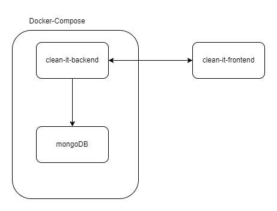

# Clean It! AG - Application Architecture

## Table of Contents
- [Overview](#overview)
- [Architecture](#architecture)
    - [Backend (Spring Boot)](#backend-spring-boot)
    - [Frontend (Angular)](#frontend-angular)
    - [Database (MongoDB)](#database-mongodb)
- [Docker Setup](#docker-setup)
    - [Docker Compose](#docker-compose)
- [Running the Application](#running-the-application)
- [Endpoints](#endpoints)
- [Contact](#contact)

---

## Overview
This project is designed to handle daily operations for a fictional textile cleaning company, **Clean It! AG**. The application consists of a Spring Boot backend (which serves as the API layer), an Angular frontend for interacting with the system, and MongoDB as the database. Docker and Docker Compose are used to manage the backend and MongoDB services efficiently.

---

## Architecture


### Backend (Spring Boot)
The backend is built using **Spring Boot** and provides a REST API for managing customers, orders, and users. The backend communicates with the MongoDB database to store and retrieve data.

#### Features
- **RESTful APIs**: The backend exposes various endpoints to manage customers, orders, users, and textile items.
- **MongoDB Integration**: The backend connects to MongoDB for data storage and retrieval.
- **Dockerized**: The backend service is containerized, making it easy to deploy and scale with Docker.

#### Main Components
1. **Entities**:
    - `Customer`: Represents customers of Clean It! AG.
    - `Order`: Represents the cleaning orders linked to customers.
    - `User`: Represents employees or managers of Clean It! AG.
    - `TextileItem`: Represents individual textile items in an order.

2. **Services**:
    - Business logic to handle customer registration, order processing, and more.

3. **Controllers**:
    - Expose REST endpoints to interact with the frontend and external systems.

#### Backend Technologies
- **Java 17**
- **Spring Boot**
- **Spring Data MongoDB**
- **Maven** (for dependency management)
- **Docker**

---

### Frontend (Angular)
The frontend is built using **Angular** and serves as the user interface for employees and managers of Clean It! AG. It allows users to perform actions such as registering customers, submitting cleaning orders, and viewing order statuses.

#### Features
- **Customer Registration**: Employees can add new customers via a form.
- **Order Submission**: Employees can submit textile cleaning orders and track the status.
- **Order Status Update**: Managers can update the status of orders (e.g., from `submitted` to `cleaned`).

#### Frontend Technologies
- **Angular**
- **TypeScript**
- **RxJS** (for handling asynchronous data streams and HTTP requests)
- **Bootstrap** (for responsive UI)

---

### Database (MongoDB)
The application uses **MongoDB** as its primary database. MongoDB is a NoSQL document-based database, ideal for handling the dynamic structure of data like customer orders and textile items.

#### Features
- Stores customer data, order details, and textile items.
- Integrated with Spring Boot using the **Spring Data MongoDB** library.
- Managed via Docker and exposed on port `27017`.

---

## Docker Setup

Both the backend (Spring Boot) and MongoDB run inside Docker containers, managed by Docker Compose. Docker Compose simplifies the orchestration of these services and ensures that MongoDB is running before the backend starts.

### Docker Compose
Docker Compose is used to define and manage the containers for the backend and MongoDB.

#### `docker-compose.yml`:

```yaml
version: '3.8'
services:
  backend:
    build: .
    ports:
      - "8080:8080"
    depends_on:
      - mongodb
    environment:
      - SPRING_DATA_MONGODB_URI=mongodb://mongodb:27017/clean_it
    restart: unless-stopped

  mongodb:
    image: mongo:5.0
    restart: unless-stopped
    environment:
      - MONGO_INITDB_DATABASE=clean_it
    ports:
      - "27017:27017"
    volumes:
      - mongo-data:/data/db

volumes:
  mongo-data:
```

#### Key Points:
- **Backend** runs on port `8080`.
- **MongoDB** is exposed on port `27017`.
- The backend service uses `depends_on` to ensure MongoDB starts first.
- Data persistence is achieved via Docker volumes.

---

## Running the Application

### Prerequisites
- **Docker** and **Docker Compose** installed.
- **Node.js** (for running the Angular frontend).

### Steps to Run

1. **Clone the Repository**:

   ```bash
   git clone https://github.com/your-repository.git
   cd clean_it
   ```

2. **Run Backend and MongoDB**:

   ```bash
   docker-compose up --build
   ```

   This will build and start the Spring Boot backend and MongoDB containers.

3. **Run the Angular Frontend**:

   In a separate terminal, navigate to the frontend directory and run:

   ```bash
   cd frontend
   npm install  # Install dependencies
   ng serve     # Serve the Angular app locally
   ```

   Access the frontend at `http://localhost:4200`.

---

## Endpoints

### Backend (Spring Boot)
| Method | Endpoint                | Description                    |
|--------|-------------------------|--------------------------------|
| `GET`  | `/api/customers`         | Get all customers              |
| `GET`  | `/api/customers/email`   | Get customer by email          |
| `POST` | `/api/customers`         | Add a new customer             |
| `GET`  | `/api/orders`            | Get all orders                 |
| `POST` | `/api/orders`            | Add a new order                |
| `PUT`  | `/api/orders/{id}`       | Update order status            |

---

## Contact
If you have any questions or need further assistance, please feel free to contact:

- **Name**: Mohammad Ghannam
- **Email**: mohammadghannam892@gmail.com

---

### Notes
- Ensure that the Docker containers are running before attempting to access the backend or database.
- The frontend should be served locally or via a web server (in production environments).

